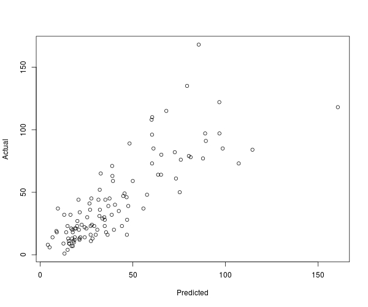

##
<div style="font-face: Sans-serif; font-size: 36pt; color: black;">
<br/><br/><br/>
CRAN package by Andrie de Vries
</div>
- and many others

##
<div style="font-face: Sans-serif; font-size: 36pt; color: black;">
<br/><br/><br/>
R interface to AzureML and the AzureML Studio
</div>
- List, download or upload workspace data frames
- List and download data from AzureML studio "experiments"
- List, consume, and publish AzureML web services

##
<div style="font-face: Sans-serif; font-size: 36pt; color: black;">
<br/><br/><br/>
Would not have been possible with out the Python package by Dino Viehland
</div>
Thanks!
<br/><br/>
<div style="font-face: Sans-serif; font-size: 12pt; color: black;">
https://github.com/Azure/Azure-MachineLearning-ClientLibrary-Python
</div>

##
<div style="font-face: Sans-serif; font-size: 36pt; color: black;">
<br/><br/><br/>
Best audience (IMO):
<br/><br/>
Azure users who want to add R to their mix
</div>

# Check it out

##
```{r, eval=FALSE}
library(AzureML)
ws <- workspace()

m <- glm(Ozone ~ ., data=airquality[sample(nrow(airquality), 100),], family=poisson)

fun <- function(newdata) predict(m, newdata=newdata, type="response")

ep <- publishWebService(ws, fun=fun, name="Ozone",
                            inputSchema=airquality,
                            data.frame=TRUE)

ans <- consume(ep, airquality)$ans
plot(ans, airquality$Ozone)
```

##
```{r, eval=FALSE}
library(AzureML)
ws <- workspace()

m <- glm(Ozone ~ ., data=airquality[sample(nrow(airquality), 100),], family=poisson)

fun <- function(newdata) predict(m, newdata=newdata, type="response")

ep <- publishWebService(ws, fun=fun, name="Ozone",
                            inputSchema=airquality,
                            data.frame=TRUE)

ans <- consume(ep, airquality)$ans
plot(ans, airquality$Ozone)
```
<div style="position: absolute; top: 150px; left: 0; z-order: 1;">

</div>
Connect to the AzureML Studio service

##
<center>

</center>


##
<div style="font-face: Sans-serif; font-size: 36pt; color: black;">
Hacker service!
</div>
```{r, eval=FALSE}
v <- publishWebService(ws,
        fun =  function(expr)
          paste(capture.output(eval(parse(text=expr))), collapse = "\n"),
        name="commander",
        inputSchema = list(x = "character"), outputSchema=list(foo = "character"))

cat(consume(v, list(x = "Sys.info()"))$foo)

#        sysname         release         version        nodename         machine 
#      "Windows"         "7 x64"    "build 9200"        "CLIENT"        "x86-64" 
```

# What next?

##
<div style="font-face: Sans-serif; font-size: 36pt; color: black;">
<br/><br/><br/>
API interface is under revision
<br/><br/>
</div>
(mostly under the hood stuff)

##
<div style="font-face: Sans-serif; font-size: 26pt; color: black;">
Things to improve:
</div>
- Data marshling is TSV/CSV right now, kinda sucks  :(
    - Use the .NET/mono array class?
    - Use Apache Arrow/feather? [yes, use this] &nbsp;&nbsp;  :-)
    - Ditto for Python
- Maybe just drop the whole `outputSchema` thing?
- I want an interface to the blob storage service
- Integration with R parallel/distributed programming tools
    - `foreach` (from Revolution!)
    - Ditto for Python (`celery`? or maybe that Jupyter 0MQ thing?)
- Need a formal AzureML studio API specification!  >:(


##
<div style="font-face: Sans-serif; font-size: 36pt; color: black;">
<br/><br/><br/>
What do you think? Let's talk!
<br/><br/>
</div>
