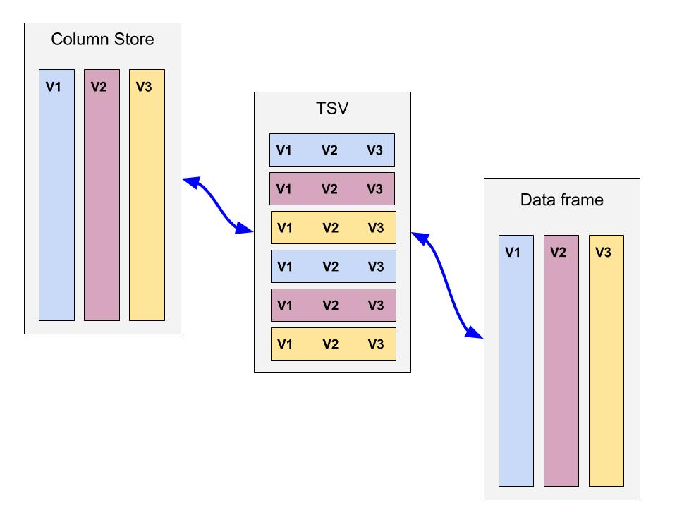

##
<div style="font-size: 65px; font-weight: 600; color: #595959; margin-left: 60px;">
<br/><br/><br/><br/>
R and Python and Stan and You
</div>

##
<div style="font-face: Sans-serif; font-size: 36pt; color: black;">
<br/><br/><br/>
Language wars are for linguists.
</div>

#
<div style="position: absolute; top: 0; left: 0; width: 100%; height: 100%; bg: white;">
</img>
</img>
</div>

##
<div style="font-face: Sans-serif; font-size: 36pt; color: black;">
<br/><br/><br/>
The rest of us speak like our families, friends, and colleagues do.
</div>

#
<div style="position: absolute; top: 0; left: 0; width: 100%; height: 100%; bg: white;">
</img>
</img>
</div>

##
<div style="font-face: Sans-serif; font-size: 36pt; color: black;">
<br/><br/><br/>
Literature is usually more important to us than language.
</div>

##
<div style="font-face: Sans-serif; font-size: 36pt; color: black;">
<br/><br/><br/>
Lots of first-rate work is written today in R and Python.
</div>

##
<div style="font-face: Sans-serif; font-size: 36pt; color: black;">
<br/><br/><br/>
Lots of first-rate work is written today in R and Python and Stan.
<br/><br/>
That's why they're so important.
</div>

##
<div style="font-face: Sans-serif; font-size: 26pt; color: black;">
Google Scholar citations 2015 -- present
</div>
<center>
```{r, echo=FALSE}
s = read.table("scholar", sep=",", comment.char="#", header=TRUE)
s = s[order(s[,3], decreasing=TRUE), ]
barplot(s[,3], names=s$lang, col=colorRampPalette(c("blue", "green", "yellow", "red"))(5))
```
</center>
<div style="font-face: Sans-serif; font-size: 14pt; color: black;">
Following similar methodology to Muenchen (http://r4stats.com/articles/how-to-search-for-analytics-articles/), search conducted on 28-April, 2016.
</div>

##
<div style="font-face: Sans-serif; font-size: 26pt; color: black;">
arXiv.org full text search
</div>
<center>
```{r, echo=FALSE}
a = data.frame(language=c("R", "SAS", "MATLAB", "Python", "Julia", "Stan"), citations=c(318, 117, 273, 257, 2, 298))
a = a[order(a$citations, decreasing=TRUE),]
barplot(a$citations, names=a$lang, col=colorRampPalette(c("blue", "green", "yellow", "magenta"))(5))
```
</center>

##
<div style="font-face: Sans-serif; font-size: 36pt; color: black;">
<br/><br/><br/>
Literature is the key to their success
<br/><br/>
</div>

##
<div style="font-face: Sans-serif; font-size: 36pt; color: black;">
<br/><br/><br/>
Literature is the key to their success
<br/><br/>
CRAN &nbsp; &nbsp; &nbsp; &nbsp; &nbsp; &nbsp; PyPI
</div>

##
<div style="font-face: Sans-serif; font-size: 36pt; color: black;">
Some examples...
<br/><br/><br/>
State-of-the-art IRL methods availablility:
</div>
- MATLAB (ca 2006)
- R (ca 2008)
- Python (ca 2012)

##
<div style="font-face: Sans-serif; font-size: 36pt; color: black;">
<br/><br/><br/>
Equally state-of-the-art Martinsson, Rokhlin, Tygert methods not yet in R (AFAIK)
</div>

##
<div style="font-face: Sans-serif; font-size: 36pt; color: black;">
<br/><br/><br/>
FastLMM
</div>
Both Python and R implementations.

<div style="font-face: Sans-serif; font-size: 14pt;">
http://research.microsoft.com/en-us/um/redmond/projects/MSCompBio/Fastlmm/
</div>


# Recent trends

##
<div style="font-face: Sans-serif; font-size: 36pt; color: black;">
<br/><br/><br/>
Cooler conferences
</div>

##
<div style="font-face: Sans-serif; font-size: 36pt; color: black;">
<br/><br/><br/>
2016 NYR Conference
</div>
- Many R talks
- 3 Stan talks
- 2 Python/R talks
- 1 Julia talk

##
<div style="font-face: Sans-serif; font-size: 36pt; color: black;">
<br/><br/><br/>
Open Data Science Conference
<br/><br/>
Strange Loop
</div>

##
<div style="font-face: Sans-serif; font-size: 36pt; color: black;">
<br/><br/><br/>
API-ification of data and methods
</div>
- AzureML
- TensorFlow
- Spark data frames
- ADAM
- S3, Azure blob store

##
<div style="font-face: Sans-serif; font-size: 36pt; color: black;">
<br/><br/><br/>
&Agrave; la carte tools
</div>
- Jupyter
- All that cool/crazy JavaScript!
    - Python Bokeh
    - R htmlwidgets

##
<div style="font-face: Sans-serif; font-size: 36pt; color: black;">
<br/><br/><br/>
Mixing and matching tools has pitfalls!
</div>

##
<div style="font-face: Sans-serif; font-size: 36pt; color: black; text-align: right; z-index: 100;">
Yuck!
</div>
</img>

##
<div style="font-face: Sans-serif; font-size: 36pt; color: black;">
<br/><br/><br/>
Feather
</div>
https://github.com/wesm/feather


##
<div style="font-face: Sans-serif; font-size: 36pt; color: black;">
Appendix
</div>
<div style="font-face: Sans-serif; font-size: 12pt; color: black; overflow-x: auto;">
Google Scholar and arXiv searches, conducted on 28 April, 2016
<br/>
https://scholar.google.com/scholar?as_ylo=2016&q=%22r-project.org%22+(%22statistical+analysis%22+OR+%22t+test%22+OR++%22regression+analysis%22+OR+%22quantitative+analysis%22+OR++%22data+analytics%22+OR+%22machine+learning%22+OR++%22artificial+intelligence%22+OR+%22analysis+of+variance%22+OR++%22anova%22+OR+%22chi+square%22+OR+%22data+mining%22)&hl=en&as_sdt=1,48
<br/>
https://scholar.google.com/scholar?as_ylo=2016&q=%22sas+institute%22+(%22statistical+analysis%22+OR+%22t+test%22+OR++%22regression+analysis%22+OR+%22quantitative+analysis%22+OR++%22data+analytics%22+OR+%22machine+learning%22+OR++%22artificial+intelligence%22+OR+%22analysis+of+variance%22+OR++%22anova%22+OR+%22chi+square%22+OR+%22data+mining%22)&hl=en&as_sdt=1,48
<br/>
https://scholar.google.com/scholar?as_ylo=2016&q=%22matlab%22+(%22statistical+analysis%22+OR+%22t+test%22+OR++%22regression+analysis%22+OR+%22quantitative+analysis%22+OR++%22data+analytics%22+OR+%22machine+learning%22+OR++%22artificial+intelligence%22+OR+%22analysis+of+variance%22+OR++%22anova%22+OR+%22chi+square%22+OR+%22data+mining%22)&hl=en&as_sdt=1,48
<br/>
https://scholar.google.com/scholar?as_ylo=2016&q=%22python%22+-snake+(%22statistical+analysis%22+OR+%22t+test%22+OR++%22regression+analysis%22+OR+%22quantitative+analysis%22+OR++%22data+analytics%22+OR+%22machine+learning%22+OR++%22artificial+intelligence%22+OR+%22analysis+of+variance%22+OR++%22anova%22+OR+%22chi+square%22+OR+%22data+mining%22)&hl=en&as_sdt=1,48
<pre>
arXiv.org full text search all articles
"MATLAB"  273
"SAS Institute" 117
"r-project.org" 318
"julia programming language" or "julia language" 2
"Python" 257
"Stan" 298
</pre>
</div>
